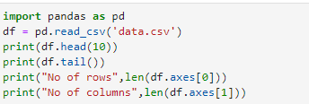
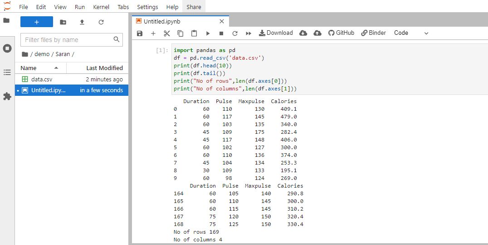

# Read-from-CSV

## AIM:
To write a python program to read the datas from a CSV file.

## ALGORITHM:

### Step 1:
Download a CSV file

### Step 2:
Open a python platform

### Step 3:
Create a folder in python

### Step 4:
Copy the downloaded CSV file to the python folder

### Step 5:
Run the program

## PROGRAM:
~~~

Program Developed by : Sarankumar J
Reference number : 21500780

import pandas as pd
df = pd.read_csv('nba.csv')
print(df.head())
print(df.tail())
print("Column",len(df.axes[0]))
print("Rows",len(df.axes[1]))

~~~

## OUTPUT:

## RESULT:
Thus a CSV file is read successfully using python programming.
